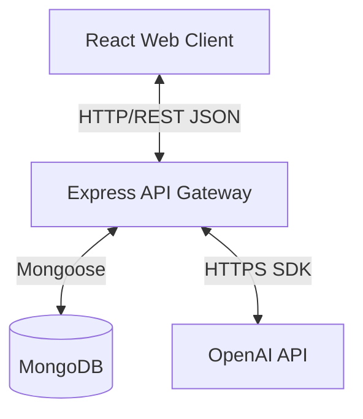

# AI Career Roadmap Generator (ACRG) — Detailed Status & SRS Report

This document presents a comprehensive evaluation of the **AI Career Roadmap Generator (ACRG)** project. It extracts and documents the complete requirements from `p17.pdf`, compares them with the current codebase implementation, provides detailed completion metrics, identifies structural mismatches/gaps, and details a formal Software Requirements Specification (SRS).

---

## 1. Executive Summary

- **Domain:** Personalized career planning, skill assessment, and adaptive guidance.
- **Problem Statement:** Students struggle with disconnected learning materials and lack a structured, personalized path that reflects their current skill levels, available time, target career goals, and verifiable project evidence.
- **Proposed Solution:** A full-stack web application that allows students to define a career profile, set goals, catalog their skills, analyze their skill gaps, generate an AI-powered custom learning roadmap, track weekly milestones, and seek mentor reviews.
- **Current Development State:**
  - **Overall Project Completion:** **~55%**
  - **Backend Progress:** **~90%** (Fully functional database models, Zod validation schemas, Controllers, Express routes, and OpenAI service integration. Redis background jobs are currently stubbed out as per configuration requirements.)
  - **Frontend Progress:** **~20%** (Complete project setup, design system tokens, global state stores, router, layouts, and fully operational Authentication screens. However, all other functional module screens remain static skeleton pages with mock data.)

---

## 2. Functional Requirements Comparison Matrix

Below is a detailed comparison between the functional requirements defined in `p17.pdf` and their corresponding implementations in the current codebase.

| Req ID | Module / Feature | Specified Requirements (from `p17.pdf`) | Backend Implementation Status | Frontend Implementation Status | Completion % |
| :--- | :--- | :--- | :--- | :--- | :---: |
| **FR-01** | **Career Profile** | Onboarding entry point; validated profile requests; loading/empty/error states; search/filter capabilities; state change logging. | **Done (95%)** - Schema, Model, Service, and Routes defined (`/career-profile`) | **Partial (20%)** - Static `ProfilePage.jsx` and `EditProfilePage.jsx` exist; no API integrations. | **57.5%** |
| **FR-02** | **Goal Selection** | Workspace for creating, editing, and saving draft goals; role-based views. | **Done (95%)** - Schema, Model, Service, and Routes defined (`/career-goals`) | **Partial (20%)** - `GoalsListPage.jsx`, `GoalDetailsPage.jsx`, and `CreateGoalPage.jsx` are placeholders. | **57.5%** |
| **FR-03** | **Skill Inventory** | Screen to track technical and soft skills, assign levels, and attach evidence. | **Done (95%)** - Schema, Model, Service, and Routes defined (`/skills`) | **Partial (15%)** - Static `SkillsPage.jsx` is a skeleton page showing empty state. | **55.0%** |
| **FR-04** | **Gap Analysis** | Compute missing skills against target profiles; calculate readiness score. | **Done (100%)** - Service computes score and priority areas; Router registered. | **Partial (15%)** - Static `GapAnalysisPage.jsx` with no API binding or query logic. | **57.5%** |
| **FR-05** | **Roadmap Builder** | Generate roadmap; display weekly plan, learning paths, and recommended milestones. | **Done (90%)** - Integration with OpenAI via `openai.service.ts` works; schema-validated responses. | **Partial (15%)** - `RoadmapGeneratorPage.jsx` and `RoadmapResultPage.jsx` are skeletons. | **52.5%** |
| **FR-06** | **Progress Tracking** | Log milestones as complete; update dashboards; record completion history. | **Done (95%)** - Schema, Model, Service, and Routes defined (`/progress`). | **Partial (15%)** - Static `ProgressPage.jsx` template with hardcoded dashboard graphs. | **55.0%** |
| **FR-07** | **Project Planner** | Suggest hands-on project recommendations based on skill gaps and stage. | **Done (95%)** - OpenAI-linked project planner service; Schema & Model implemented. | **Partial (15%)** - Static `ProjectsPage.jsx` showing placeholder mock listings. | **55.0%** |
| **FR-08** | **Mentor Review** | Allows Mentors to comment and approve/disapprove milestones. | **Done (95%)** - Model, Service, and Routes ready (`/mentor-review`). | **Partial (15%)** - Static `MentorReviewPage.jsx` template without backend binding. | **55.0%** |
| **-** | **Notifications Center** | Trigger notifications for system alerts, feedback, and milestones. | **Done (95%)** - Model, Service, and Routes ready (`/notifications`). | **Partial (20%)** - Static `NotificationsPage.jsx` with hardcoded notifications array. | **57.5%** |
| **-** | **Admin Dashboard** | Manage users, configure skills/goals, list logs, and inspect events. | **Done (90%)** - Audit logs and analytics routers. CRUD operations for users. | **Partial (20%)** - Skeletons for `AdminUsersPage`, `AdminGoalsPage`, `AdminSkillsPage`, `AdminLogsPage`. | **55.0%** |
| **-** | **CORS & CORS Control** | Explicit origin controls for Vite dev environments, secure cookie handling. | **Done (100%)** - Hardened in `app.ts` to allow specific origins. | **Done (100%)** - Enabled in Vite config and Axios client. | **100.0%** |
| **-** | **Authentication & Auth** | Registration, Login, Token Refresh, Role-Based Route guards, `/me` profile. | **Done (100%)** - Secure password hashing, dual JWT strategy, `/auth/me` endpoints. | **Done (100%)** - Dynamic login page, role dashboard redirects, HTTP interceptor retry logic. | **100.0%** |

---

## 3. Structural Gaps & Mismatch Analysis

During our analysis of both repositories, several critical mismatches and unfinished components were discovered. These must be resolved before proceeding with final integration.

### A. Frontend to Backend Endpoint Path Mismatches
The frontend Axios services make API requests to endpoints that do not map directly to the backend Express route registration:
1. **Career Profile:** 
   - *Frontend:* Calls `GET /api/v1/profile` and `PUT /api/v1/profile` (as per `API_ENDPOINTS.PROFILE`).
   - *Backend:* Registers `app.use('/api/v1/career-profile', careerProfileRouter)`.
2. **Career Goals:**
   - *Frontend:* Calls `/goals` endpoints.
   - *Backend:* Registers `app.use('/api/v1/career-goals', goalRouter)`.
3. **Analytics Dashboard:**
   - *Frontend:* Calls `/analytics/dashboard`.
   - *Backend:* The endpoint exists as `/api/v1/admin/analytics` inside the `adminRouter`.

### B. Missing Frontend API Integration
While the frontend `services/api/index.js` defines basic functions (e.g., `goalsAPI.list()`, `skillsAPI.create()`), none of the React pages under `features/acrg/*` actually invoke these service calls. Instead, they use hardcoded arrays (e.g., `[]` or dummy objects) and static JSX components.

### C. Background Event Queue and Redis Status
- The specification in `p17.pdf` recommends using Redis with a BullMQ queue for background tasks (e.g., generating AI plans and sending notification emails) to avoid blocking the main API thread.
- Currently, Redis is **fully stubbed out** (`redisClient = null` in `backend/src/config/redis.ts` and `roadmapQueue = null` in `backend/src/jobs/queue.ts`) due to operational requirements. While this enables the server to start without needing a running local Redis server, it means that AI roadmap generation runs **synchronously** in the controller thread.

---

## 4. What is Left to Implement (Action Plan)

To transition this project from a modular skeleton to a fully working production application, the following items must be implemented:

1. **Resolve API Endpoint Mismatches:** Update the frontend `API_ENDPOINTS` values in `frontend/src/constants/index.js` to match the backend router mount points (or vice versa).
2. **Connect Frontend Pages to APIs:**
   - Modify `ProfilePage.jsx` and `EditProfilePage.jsx` to fetch and submit profile details via `useQuery`/`useMutation` and `profileAPI`.
   - Hook up `GoalsListPage.jsx`, `CreateGoalPage.jsx`, and `GoalDetailsPage.jsx` to list, create, and view goals.
   - Bind `SkillsPage.jsx` to retrieve and add skills.
   - Integrate `GapAnalysisPage.jsx` to show computed readiness indicators.
   - Hook up `RoadmapGeneratorPage.jsx` to send target inputs and transition into `RoadmapResultPage.jsx` to view the OpenAI generated weekly task sequence.
3. **Implement Real Audit & Analytics Triggers:** Ensure that core backend events (like profile updates, roadmap generation, and mentor approvals) append entries to `AuditEventModel` and `AnalyticsEventModel`.
4. **Build Seeding Scripts:** Provide initial career goals, standard skills directory, and test user seed data in `backend/src/database/seeds` to satisfy the demo environment criteria.

---

## 5. Software Requirements Specification (SRS)

### 5.1 Introduction

#### 5.1.1 Purpose
This document specifies the software requirements for the AI Career Roadmap Generator (ACRG), an interactive platform designed to help students map out academic and career skills through AI planning models, structured milestones, and feedback loops.

#### 5.1.2 Scope
ACRG is a full-stack modular monolith featuring a React Single Page Application (SPA) on the frontend and an Express-based REST API on the backend. The system integrates with OpenAI to generate tailored learning paths and project recommenders.

#### 5.1.3 Definitions, Acronyms, and Abbreviations
- **ACRG:** AI Career Roadmap Generator.
- **JWT:** JSON Web Token (used for secure session propagation).
- **Zod:** A schema validation library.
- **SRS:** Software Requirements Specification.
- **MVP:** Minimum Viable Product.

---

### 5.2 Overall Description

#### 5.2.1 Product Perspective
ACRG functions as an independent web application. The frontend uses a modular React architecture styled with Tailwind CSS, communicating via JSON payloads over HTTP with the Express backend, backed by a MongoDB database cluster.

#### 5.2.2 Product Functions
- User registration, login, email verification, and role-based dashboard routing.
- Career profile creation, education tracking, and CV uploads.
- Goal tracking, skill logging, and automated gap comparison.
- AI generation of multi-week roadmaps (weekly tasks, recommended milestones, and projects).
- Progress updating, dashboard analytics graphs, notifications, and mentor reviews.

#### 5.2.3 User Classes and Characteristics
- **Student:** Can create career goals, submit skills, generate AI roadmaps, update their progress, and view dashboard analytics.
- **Career Mentor:** Can view student dashboards, leave review comments, and approve completion updates.
- **Placement Officer:** Can search records, track campus-wide readiness statistics, and export reports.
- **Admin (Career Content Administrator):** Can manage user accounts, check audit event logs, and configure base system records.

---

### 5.3 System Features / Functional Requirements

#### 5.3.1 FR-01: Career Profile
- **Description:** Captures the student's demographic details, educational level, interests, and domain preferences.
- **Inputs:** Education history, tech domain of choice, key interest list.
- **Processing:** Validates fields via Zod, updates/creates the `CareerProfile` document, binds it to the current user id.
- **Outputs:** Persisted profile returned in standard response format.

#### 5.3.2 FR-02: Goal Selection
- **Description:** Allows students to select target roles (e.g. Full Stack Developer, ML Engineer) and input desired career destinations.
- **Inputs:** Selected target title, category, description, and timeline goals.
- **Processing:** Saves goal to `CareerGoal` collection. Emits event on creation.
- **Outputs:** Display of active target goals on student dashboard.

#### 5.3.3 FR-03: Skill Inventory
- **Description:** Records current technical capability levels (Beginner, Intermediate, Advanced) and catalogs evidence of skill mastery.
- **Inputs:** Skill name, level selection, evidence details.
- **Processing:** Validates and saves to `Skill` collection.
- **Outputs:** Summary grid showing user's current cataloged capability.

#### 5.3.4 FR-04: Gap Analysis
- **Description:** Compares the list of current skills in the inventory against the required skills for the selected target career goal.
- **Inputs:** Array of inventory skills and target career goal schema skills.
- **Processing:** Computes missing skill set and generates a numerical readiness percentage:
  $$\text{Readiness Score} = \left( \frac{\text{Skills Covered}}{\text{Total Target Skills}} \right) \times 100$$
- **Outputs:** Custom list of gaps and readiness indicator visualization.

#### 5.3.5 FR-05: Roadmap Builder
- **Description:** Calls the AI service to build a personalized timeline indicating what the user must learn.
- **Inputs:** Career target title, current capabilities, identified gap list.
- **Processing:** Sends prompt payload to OpenAI. Validates structured JSON response (must include weekly plans, milestones, and learning nodes).
- **Outputs:** Multi-week structured roadmap with checklists, milestones, and actionable resources.

#### 5.3.6 FR-06: Progress Tracking
- **Description:** Lets students log progress against generated weekly tasks and milestones.
- **Inputs:** Task checkbox clicks, milestone validation requests.
- **Processing:** Updates completion flags in `Roadmap` and generates audit records.
- **Outputs:** Dynamic updates on the dashboard progress metrics.

#### 5.3.7 FR-07: Project Planner
- **Description:** Recommends specific coding/architectural projects that bridge target skill gaps.
- **Inputs:** Target career title, current gap analysis, current skill level.
- **Processing:** AI matches and formats project briefs (title, description, features to build).
- **Outputs:** Actionable hands-on projects suggestions displayed inside the workspace.

#### 5.3.8 FR-08: Mentor Review
- **Description:** Facilitates mentor review comments and milestone verification signatures.
- **Inputs:** Comments, approval actions.
- **Processing:** Records mentor comments in database, transitions the milestone status to `Approved` or `Needs Revision`.
- **Outputs:** Live feedback notifications delivered to the student.

---

### 5.4 External Interface Requirements

#### 5.4.1 User Interfaces
- Responsive web screens tailored for mobile/desktop viewports.
- Interactivity indicators including initial skeleton animations, loading bars, toast alerts, empty states, and validation warnings.

#### 5.4.2 Software Interfaces
- **Database:** MongoDB (connection via Mongoose).
- **AI Engine:** OpenAI SDK (model configuration: `gpt-4.1-mini`).
- **File Storage:** Cloudinary integration for resume/evidence attachments.

---

### 5.5 Other Non-Functional Requirements

#### 5.5.1 Security
- Password storage using `bcrypt` (12 rounds).
- Dual JWT auth architecture: Access tokens (short-lived, 15m) + Refresh tokens (long-lived, 7d).
- CORS headers limited to allowlisted clients (`localhost:3000` / `localhost:5173`).
- Route-level and ownership guards enforced independently on both backend routers and controllers.

#### 5.5.2 Reliability
- Explicit API response wrappers `{ data, meta, error }` standardize error handling.
- Graceful fallbacks on AI parsing failure (JSON repair fallback rules).
